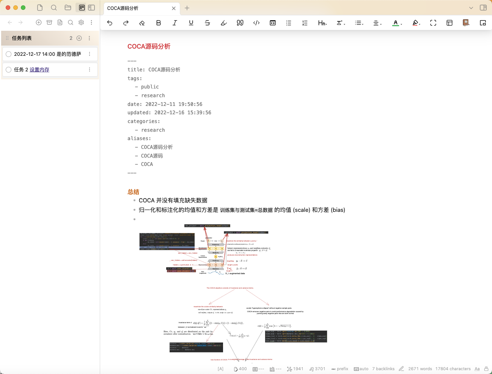

# Obsidian Kanban Sidebar Plugin
A modified version of [obsidian-kanban](https://github.com/mgmeyers/obsidian-kanban)


# Why change this?
I need a task manager and navigation on the left sidebar for the Obsidian, i.e., 


## settings in .md

Add the settings to the end of the kanban file (a .md file).

%% kanban:settings
```
{"kanban-plugin":"basic","new-line-trigger":"enter","show-checkboxes":true,"link-date-to-daily-note":true,"new-card-insertion-method":"prepend-compact","hide-card-count":false,"hide-tags-in-title":false,"hide-tags-display":false,"show-add-list":true,"show-relative-date":true,"hide-date-display":false,"date-picker-week-start":0,"prepend-archive-date":true}
```
%%

## obsidian.css 
append the following css to  file `.obsidian/snippets/obsidian.css`.

```python
/* obsidian kanban */
.kanban-plugin__board>div{
  display: block;
  margin-bottom: 10px;
}

.kanban-plugin__lane{
	border: none;
}

.kanban-plugin__scroll-container.kanban-plugin__vertical{
    padding: 0;
    border: 3px solid #fcf3e8;
    border-top: none;
    border-radius: 0;
    margin: 0 0.12px;
    margin-bottom: 2em;
}
.kanban-plugin__item-button-wrapper{
  border-radius: 2px !important; 
  padding: 0.2em !important; 
  background-color: none;
  border:none;
}

.kanban-plugin__lane-header-wrapper{
  background: linear-gradient(220.55deg, #FFF6EB 0%, #DFD1C5 100%) !important;
} 
```
