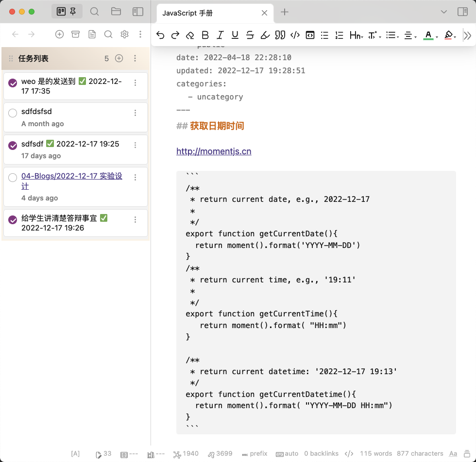

# Obsidian Kanban Sidebar Plugin
A modified version of [obsidian-kanban](https://github.com/mgmeyers/obsidian-kanban)


# Why change this?
I need a task manager and a navigation on the left sidebar for the Obsidian, i.e., 


# Where code is modified by me?

Changed in `src/components/Lane/Lane.tsx`
```
    <div
      ref={measureRef}
      className={classcat([
        c('lane-wrapper'),
        {
          'is-sorting': isSorting,
        },
      ])}
      # remove style={laneStyles}
    >
```

Changed in `src/main.less`
``` 
.kanban-plugin {
  --lane-width: 100%;
}
```

`obsidian.css`
```
/* obsidian kanban */
.kanban-plugin__board>div{
  display: block;
  margin-bottom: 10px;
}

.kanban-plugin__lane{
	border: none;
}

.kanban-plugin__scroll-container.kanban-plugin__vertical{
    margin: 0;
    padding: 0;
    background: none;
    border: none;
}
.kanban-plugin__item-button-wrapper{
  border-radius: 2px !important; 
  padding: 0.2em !important; 
  background-color: none;
  border:none;
}
``` 